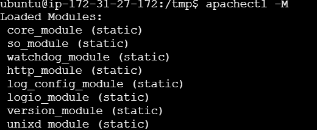

# HARDERING DE APACHE 

Este proyecto va a tratar es reforzar la seguridad de un servidor Apache en una instancia EC2 con Ubuntu 22.04 y contara con los siguientes archivos **main.tf**,  **srcipt.sh** y **variables.tf**

---
## Revisión y desactivación de módulos innecesarios
### Modulos a desactivar

#### mod_status 
- Expone informacion interna(IP, rutas, procesos)
- Al exponer informacion interna es util para el atacante ya que le aporta informacion

#### mod_info
- Muestra rutas, modulos y direcciones internas

#### mod_autoindex
- Muestra el contenido del sirectorio sin el index.html
- Permite explorar archivos sensibles

#### mod_userdir
- Exposicion de archivos de usuarios 
- Poco control en entornos multiusuario

#### mod_cgi
- Ejecucion remota de codigo si esta mal configurado 
- Historicamente Vulnerable

#### mod_negotiation
- Ataques de tipo **file disclosure**

#### mod_include
- Obsoleto en muchos casos
- Posible ejecucion de comandos 

---
<br/>
<br/>
<br/>

### Usamos el siguiente comando para ver los modulos activos
```bash
    apachectl -M
```
<br/>


<br/>

### Despues desactivamos los modulos anterior mente mencionado y reiniciamos

```bash
sudo a2dismod status_module
sudo a2dismod info
sudo a2dismod autoindex_module
sudo a2dismod userdir
sudo a2dismod cgi
sudo a2dismod cgid
sudo a2dismod negotiation_module
sudo a2dismod include

systemctl restart apache2
```

### Para comprobar el estado de los modulos por si se han eliminado
<br/>

```bash
apachectl -M | grep -E "userdir"
```
---
### Links info
- [tnable.com](https://www.tenable.com/audits/CIS_Apache_HTTP_Server_2.4_Benchmark_v2.0.0_Level_1)

- [twaino.com](https://www.twaino.com/es/blog/crear-un-sitio-web/servidor-apache-una-guia-completa-para-principiantes/#53_Desactive_los_modulos_innecesarios)

- [Apache](https://httpd.apache.org/docs/trunk/es/mod/mod_status.html)

<br/>

---

## Ocultar información del servidor

